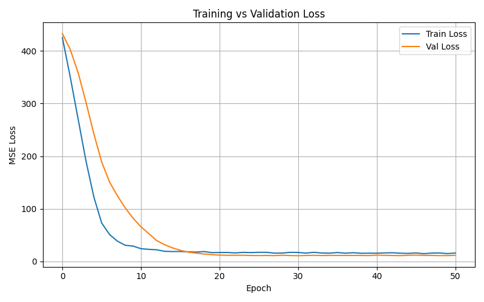
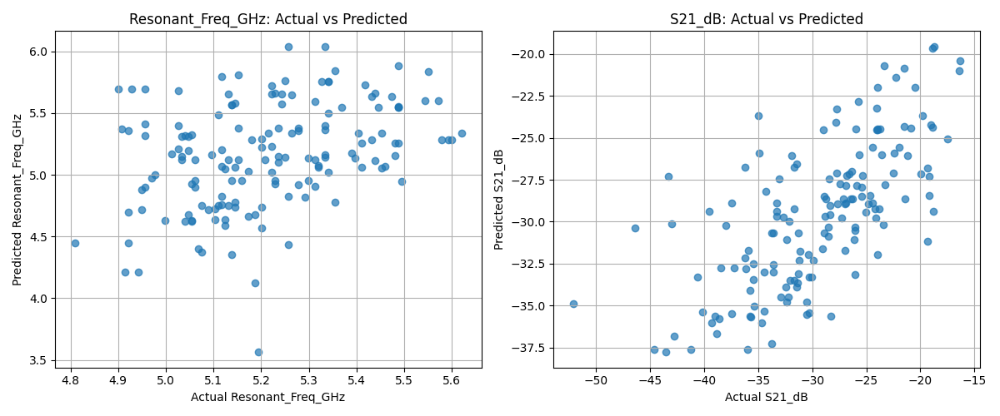

# 🧪 Noninvasive Blood Glucose Monitoring Using FC-CSRR Sensor and Machine Learning

This project implements a machine learning-based system for noninvasive blood glucose monitoring using a four-concentric-ring complementary split-ring resonator (FC-CSRR) sensor. The system is developed as part of the MIE 437 - Artificial Intelligence course.

## 📂 Project Structure

```
noninvasive-glucose-ml/
├── data/                     # Experimental and cleaned data
│   ├── C1024.xlsx
│   └── cleaned_valleys.csv
├── models/                   # Trained model and performance plots
│   ├── single_step_model.keras
│   ├── loss_curve.png
│   └── pred_vs_actual.png
├── streamlit_app.py          # Streamlit interface for live predictions
├── train_single_step.py      # Model training script (Single-Step DNN)
├── data_preprocessing.py     # Data cleaning and valley extraction
├── requirements.txt          # Python dependencies
├── README.md                 # Project overview and instructions
└── .gitignore
```

---

## 🎯 Project Overview

This work addresses the challenge of invasive glucose monitoring methods by using an electromagnetic FC-CSRR sensor. Design parameters are fed into a trained neural network model to estimate:

* **Resonant Frequency (GHz)**
* **S21 Magnitude (dB)**

Model and app are built with:

* Deep Neural Network (DNN)
* Batch Normalization, Dropout
* TensorFlow/Keras
* Streamlit UI

---

## 🧠 Model Summary

| Input Features         | Output Predictions            |
| ---------------------- | ----------------------------- |
| `r1`, `r2`, `r3`, `r4` | `Resonant_Freq_GHz`, `S21_dB` |

* 1022 valid data points used from Network Analyzer experiments
* Model trained using MSE loss, evaluated with RMSE, R², MAPE

---

## 🚀 Getting Started

### 1. Clone the Repo

```bash
git clone https://github.com/MegaCluster/noninvasive-glucose-ml.git
cd noninvasive-glucose-ml
```

### 2. Install Dependencies

```bash
pip install -r requirements.txt
```

### 3. Run the Streamlit App

```bash
streamlit run streamlit_app.py
```

### 4. (Optional) Retrain the Model

```bash
python train_single_step.py
```
## 🖼️ Screenshots

### 🔮 Streamlit Prediction UI

---


### 📈 Training Metrics



### 🔍 Predicted vs Actual Output



---

## 📜 Academic Info

* **Course**: MIE 437 - Artificial Intelligence
* **Instructor**: Dr. Ahmed Gomaa
* **Project Type**: Research Project
* **Team**: Solo or Group of 2–3
* **Submission**: May 2025

---

## 🧑‍💻 Authors

* \[Abdalla Mohamed Abdalla] – CSE_Student

---

## 📘 References

* Mansour, E. et al., "Utilizing Various Deep Neural Network Technologies to Evaluate FC-CSRR Sensor Performance In Biomedical Applications."
* Dataset: Experimental results from Network Analyzer (C1024.xlsx)

---

## 📄 License

This project is licensed under the E-JUST License.
